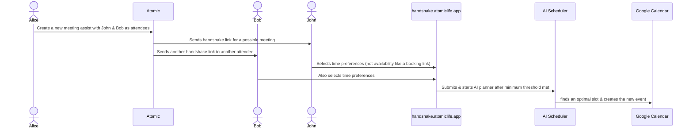

# Atomic-Scheduler - a part of [Atom](https://github.com/rush86999/atom)

## Table of Contents
- [Table of Contents](#table-of-contents)
- [Problem](#problem)
- [Demo](#demo)
- [Features](#features)
    - [Benefits of Self Hosted](#benefits-of-self-hosted)
  - [Cloud Hosted Atomic](#cloud-hosted-atomic)
  - [Customize Atomic for your team on your cloud](#customize-atomic-for-your-team-on-your-cloud)
- [Diagram](#diagram)
  - [Meeting Assist](#meeting-assist)
- [Docker](#docker)
- [Support the Project](#support-the-project)
- [Contributing](#contributing)

## Problem
Scheduling and managing time is always a problem. Finding time that works for everybody is a bigger problem. What if you can tell your calendar your time preferences and priorities for things you have to do everyday. Now what if everyone on your team could do the same thing. Now finding a time becomes easier when everyone's priorities are accounted for. 

Take this even a step further with time blocks that can be placed somewhere else based on your priorities. The same goes for your team. Let all of this happen automagically for you and your team on a daily basis before work starts.

All of this is possible with vector based search to create a memory for your calendar and Autopilot.

What if your calendar had a brain?

Memory + Decisions + Natural Conversation Interface => Perfect Time Management Assistant

It will be easier than ever to teach, find, block, create, meet, schedule, update and more with your calendar using ChatGPT. The goal is to allow a natural conversation with your calendar assistant for your end goals.

Examples:

1. "Schedule a meeting with [person] at [date and time] for [purpose]."
2. "Remind me to follow up with [person] on [date] regarding [topic]."
3. "Block off [time frame] for [task or activity]."
4. "Find an available time slot for a team meeting with [list of attendees]."
5. "Let's respond to emails either on 8 - 11 am or 2 - 4 pm on weekdays with a priority of 3"
6. "Let's have [X] meetings on either Mondays or Wednesdays, anytime between 8 - 11 am and keep it a priority of 5"
7. "When is my next appointment?"
8. "What time is my meeting with [person] on [date]?"
9. "Are there any overlapping events on my calendar?"
10. "Do I have any free time on Thursday?"

## Demo

You can see a demo video of current features at https://www.atomiclife.app

## Features

| Feature | Description |
| ----------- | ----------- |
| Semantic search | Use unique key phrases to match semantically similar past task events and apply them to new ones. Now your past tasks are templates for new ones! Apply duration, color, time preferences, priority, tags and more. Event details are converted into vectors and indexed for search. Note: You need to "train" Atomic on existing events to create event templates for new events. Read the [docs](https://docs.atomiclife.app) for more info. |
| Automated tagging | Apply tags automatically using an AI model used for classification. Each tag comes with its own set of settings configured to apply to all matched events |
| Flexible Meetings | Create recurring 1:1's or ad hoc team meetings that works with everyone's schedule. Every attendee's calendar is taken into account. Non-Atomic users can also sync their calendars and submit their time preferences. Once setup, your flexible recurring meetings occur automagically conflict free based on your time preferences. Scheduling logic now explicitly distinguishes between `ONE_ON_ONE_MEETING` and `GROUP_MEETING` types, applying tailored constraints for optimal placement.|
| Autopilot | You can run the AI planner on Autopilot that will also search & apply features to new events based on past trained event templates. The AI planner will always run before your work day starts |
|Time Preferences |Select time preferences for flexible meetings and other modifiable events |
| Train events| You can train existing events and make them templates for new ones. Attributes you can change include transparency, buffer times, priority, time preferences, modifiable nature, tags, color, duration, break type, alarms. You can also "untrain" by turning "link off" in the event menu options.|
| Time Blocking | You can automate time blockings of tasks that have a daily or weekly deadline with priority to let Atomic place them in the right place on your calendar. The deadlines can be soft or hard based on your requirements. The system now uses a dedicated `TASK` event type, allowing for more specific scheduling rules, such as tasks spanning multiple days if needed, and respecting deadlines with refined constraints.|
|Priority | You can set priority to modifiable events. Priority of 1 is neutral. 1 has no impact on the AI planner's decision making process. Any number > 1 will impact sooner it appears on the calendar relative other low priority events.|
|Rating| You can rate events to tell Atomic how productive you were for the time block. Next run, Atomic will take it into consideration before the placing the event if it's modifiable|
| Smart Tags | You can apply settings to tags. These settings will tell Atomic how to apply features or attributes to new events that are tagged by the AI model or manually.|

### Granular Event Scheduling with EventType

To provide more accurate and flexible calendar management, Atomic's scheduling engine now utilizes a refined `EventType` system. This allows for more tailored constraint application based on the specific nature of a calendar entry. The defined types are:

*   **`TASK`**: For to-do items and work that needs to be scheduled. Tasks have specific constraints, such as respecting deadlines (with soft prioritization for earlier deadlines) and the ability to be scheduled across multiple days if necessary. They must always fall within defined working hours.
*   **`ONE_ON_ONE_MEETING`**: For meetings between two individuals. Constraints ensure availability for both participants and that all parts of the meeting occur simultaneously.
*   **`GROUP_MEETING`**: For meetings involving multiple participants. Similar to 1:1 meetings, it ensures all participants are available and scheduled for the same time slots.
*   **`EVENT`**: For general calendar entries like appointments, conferences, or other reserved time blocks that might not fit the other categories.

This `EventType`-aware approach means that the underlying OptaPlanner constraint provider can apply more nuanced rules. For example:
    - Constraints that ensure all parts of an event occur on the same day are relaxed for `TASK` type events.
    - Meeting-specific rules (like maximum number of meetings per day or back-to-back preferences) are now precisely applied only to `ONE_ON_ONE_MEETING` and `GROUP_MEETING` types.
    - General scheduling rules, like conflict avoidance and respecting user-defined work hours, apply across all relevant event types.

This enhancement leads to better schedule optimization and more intuitive handling of different kinds of calendar activities.

#### Benefits of Self Hosted
- Privacy enabled by default
- Customizable - adjust any parameters to make it work to your requirements

### Cloud Hosted Atomic
- Prioritized version
- Full customer support & bug fixes
- Road map
  - SSO for teams
  - Microsoft Outlook Calendar integration
  - ChatGPT integration for Premium version
  - Zoom video is integrated.
  - docker self-hosted version

### Customize Atomic for your team on your cloud
- Same level of support & features as cloud hosted version
- Same features
- 1 year support included
- $15 / month support afterwards
## Diagram

### Meeting Assist

## Docker
- Self hosted docker compose
- See [atomic-docker](./atomic-docker/README.md) branch for more details

## Support the Project
- I'm spending 100% of my work time on this project
- Star this repository, so I can start an Open Collective to support this project
- In process of setting up Github Sponsors
- Subscribe to my cloud hosted version so I can keep this project alive
- Follow me on Twitter: https://twitter.com/rish1_2
- Used Atomic? write a review or let me know!

## Contributing

1. Fork this repository and clone the fork to your machine
2. Create a branch (`git checkout -b my-new-feature`)
3. Implement a new feature or fix a bug and add some tests or proof of fix
4. Commit your changes (`git commit -am 'Added a new feature'`)
5. Push the branch to your fork on GitHub (`git push origin my-new-feature`)
6. Create new Pull Request from your fork

